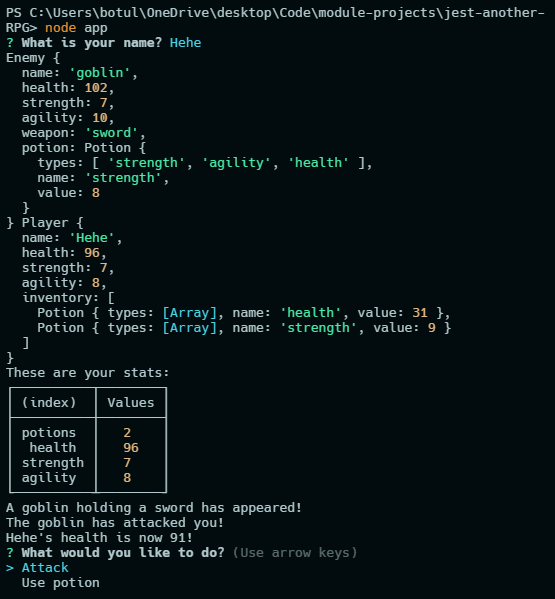

# Jest Another RPG


  
## Description

An RPG-style command-line game using an object-oriented programming (OOP) structure.
Developed using the test-driven development (TDD) paradigm.

[Deployment](https://rogeliop.dev/)



## Table of Contents

- [Installation](#installation)
- [License](#license)
- [Contributing](#contributing)
- [Tests](#tests)
- [Questions](#questions)

## Installation

This app requires Node.js to run. Simply clone this repository to your local machine, open in your preferred command-line environment, and run ```node app.js```

## License
    
Licensed under the [MIT License](https://spdx.org/licenses/MIT.html)

## Contributing

No contributions will be accepted at this time.

## Tests

No testing is planned for this project at this time.

## Questions

Have questions? Reach me at the following sources!

* GitHub: [realnifty](https://github.com/realnifty)
* E-mail: rogelioalbertopedraza@gmail.com or lovecore@pm.me